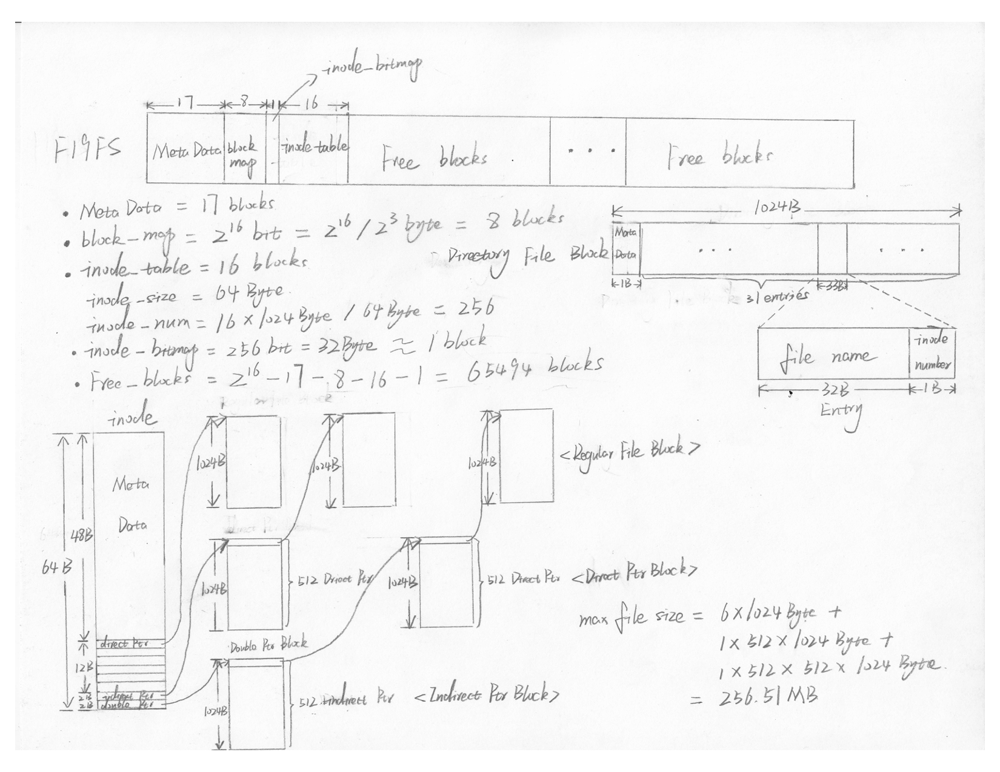

# Wheel Making 2 - Lite Linux File System

## Basic Layout and Allocation

## Implemented functions

- F19FS_t *fs_format(const char *path);

    Formats (and mounts) an F19FS file for use
     param: fname The file to format
     return: Mounted F19FS object, NULL on error

- F19FS_t *fs_mount(const char *path);

    Mounts an F19FS object and prepares it for use
     param: fname The file to mount
     Return: Mounted F19FS object, NULL on error

- int fs_unmount(F19FS_t *fs);

    Unmounts the given object and frees all related resources
     param: fs The F19FS object to unmount
     return: 0 on success, < 0 on failure

- int fs_create(F19FS_t *fs, const char *path, file_t type);

    Creates a new file at the specified location.
     Directories along the path that do not exist are not created
     param: fs The F19FS containing the file
     param: path Absolute path to file to create
     param: type Type of file to create (regular/directory)
     return: 0 on success, < 0 on failure

- int fs_open(F19FS_t *fs, const char *path);

    Opens the specified file for use
     R/W position is set to the beginning of the file (BOF)
     Directories cannot be opened
     param fs The F19FS containing the file
     param path path to the requested file
     return file descriptor to the requested file, < 0 on error

- int fs_close(F19FS_t *fs, int fd);
    
    Closes the given file descriptor
     param fs The F19FS containing the file
     param fd The file to close
     return 0 on success, < 0 on failure

- off_t fs_seek(F19FS_t *fs, int fd, off_t offset, seek_t whence);

    Moves the R/W position of the given descriptor to the given location
     Files cannot be seeked past EOF or before BOF (beginning of file)
     Seeking past EOF will seek to EOF, seeking before BOF will seek to BOF
     param fs The F19FS containing the file
     param fd The descriptor to seek
     param offset Desired offset relative to whence
     param whence Position from which offset is applied
     return offset from BOF, < 0 on error

- ssize_t fs_read(F19FS_t *fs, int fd, void *dst, size_t nbyte);

    Reads data from the file linked to the given descriptor
     Reading past EOF returns data up to EOF
     R/W position in incremented by the number of bytes read
     param fs The F19FS containing the file
     param fd The file to read from
     param dst The buffer to write to
     param nbyte The number of bytes to read
     return number of bytes read (< nbyte IFF read passes EOF), < 0 on error

- ssize_t fs_write(F19FS_t *fs, int fd, const void *src, size_t nbyte);

    Writes data from given buffer to the file linked to the descriptor
     Writing past EOF extends the file
     Writing inside a file overwrites existing data
     R/W position in incremented by the number of bytes written
     param fs The F19FS containing the file
     param fd The file to write to
     param dst The buffer to read from
     param nbyte The number of bytes to write
     return number of bytes written (< nbyte IFF out of space), < 0 on error

- int fs_remove(F19FS_t *fs, const char *path);

    Deletes the specified file and closes all open descriptors to the file
     Directories can only be removed when empty
     param fs The F19FS containing the file
     param path Absolute path to file to remove
     return 0 on success, < 0 on error

- dyn_array_t *fs_get_dir(F19FS_t *fs, const char *path);

    Populates a dyn_array with information about the files in a directory
     Array contains up to 15 file_record_t structures
     param fs The F19FS containing the file
     param path Absolute path to the directory to inspect
     return dyn_array of file records, NULL on error

- int fs_move(F19FS_t *fs, const char *src, const char *dst);
    Moves the file from one location to the other
     Moving files does not affect open descriptors
     param fs The F19FS containing the file
     param src Absolute path of the file to move
     param dst Absolute path to move the file to
     return 0 on success, < 0 on error

- int fs_link(F19FS_t *fs, const char *src, const char *dst);

    Link the dst with the src
     dst and src should be in the same File type, say, both are files or both are directories
     param fs The F18FS containing the file
     param src Absolute path of the source file
     param dst Absolute path to link the source to
     return 0 on success, < 0 on error

## Related C Library Function

### Block Store

1. truncate
- int truncate(const char *path, off_t length);
- int ftruncate(int fd, off_t length);

The truncate() and ftruncate() functions cause the regular file named by path or referenced by fd to be truncated to a size of precisely length bytes.

If the file previously was larger than this size, the extra data is lost. If the file previously was shorter, it is extended, and the extended part reads as null bytes ('\0').

The file offset is not changed.

On success, zero is returned. On error, -1 is returned, and errno is set appropriately.

2. mmap
- void *mmap(void *addr, size_t length, int prot, int flags, int fd, off_t offset);

creates a new mapping in the virtual address space of the calling process.  

The starting address for the new mapping is specified in addr.  

The length argument specifies the length of the mapping (which must be greater than 0).

The prot argument describes the desired memory protection of the mapping (and must not conflict with the open mode of the file). 

The flags argument determines whether updates to the mapping are visible to other processes mapping the same region, and whether updates are carried through to the underlying file.

3. munmap
- int munmap(void *addr, size_t length);

The munmap() system call deletes the mappings for the specified address range, and causes further references to addresses within the range to generate invalid memory references.  

The region is also automatically unmapped when the process is terminated.  On the other hand, closing the file descriptor does not unmap the region.

### TEST

1. memset
- void* memset(void* ptr, int value, size_t num);

ptr: Pointer to the block of memory to fill
value: Value to be set. The value is passed as an int, but the function fills the block of memory using the unsigned char conversion of this value
num: Number of bytes to be set to the value.

2. memcpy
- void* memcpy(void* destination, const void* source, size_t num);

Copies the values of num bytes from the location pointed to by source directly to the memory block pointed to by destination. 

### FILE_DESCRIPTOR

1. off_t

This is a signed integer type used to represent file sizes. In the GNU C Library, this type is no narrower than int. If the source is compiled with _FILE_OFFSET_BITS == 64 this type is transparently replaced by off64_t.

So in 64 bits machine, off_t equals to size_t which is 8 byte

